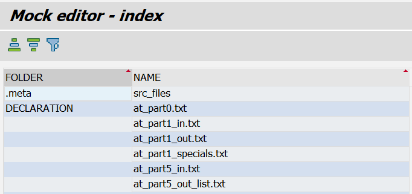
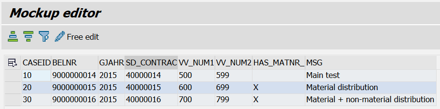
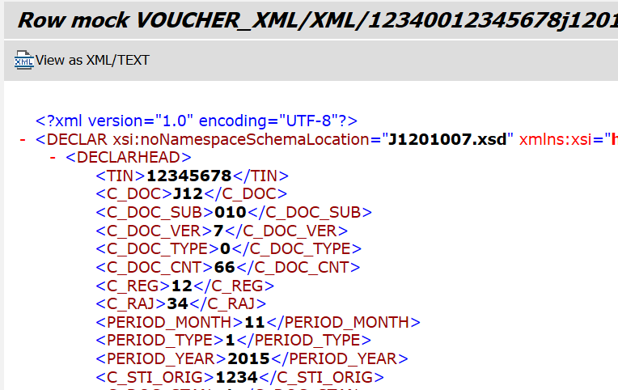

# ABAP mockup viewer for Mockup loader

In-system tool to view zip W3MI mocks created for [Mockup loader](https://github.com/sbcgua/mockup_loader) by [Mockup compiler](https://github.com/sbcgua/mockup_compiler).

## Dependencies:
- [text2tab](https://github.com/sbcgua/abap_data_parser) - the library that converts data between abap structures and tab-delimited text. Also the dependency of the mockup loader itself.
- [abapGit](https://github.com/larshp/abapGit) - to install the above

## Screenshots

## TODO
- potential develop light-weight editor abilities
